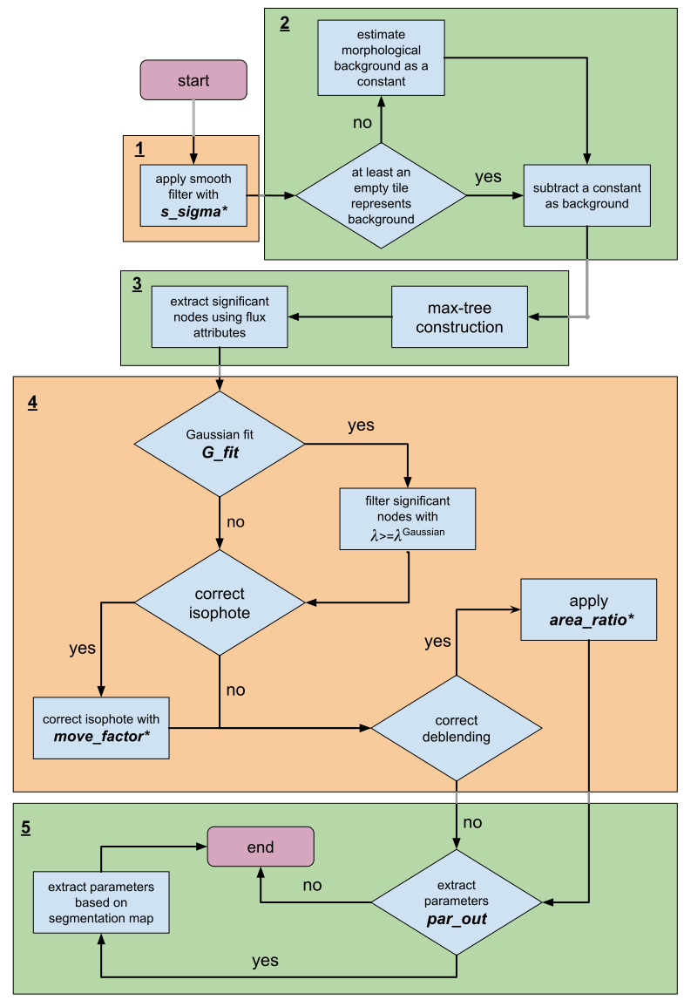

# MTO<span style="color:#FF0000">2</span> - <span  style="color:#666666">Astronomical Source Detection Tool</span>

[](https://doi.org/10.1515/mathm-2016-0006)
[](https://higra.readthedocs.io/)
[](https://www.astropy.org/)
[](https://github.com/m-faezi/MTO2/blob/main/CONTRIBUTING.md)
[](https://www.python.org)
[](https://pytorch.org/)
[](https://matrix.to/#/%23MTO2:matrix.org)


MTO2 is a photometric object (e.g., [LSB galaxies](https://en.wikipedia.org/wiki/Low_surface_brightness_galaxy)) detection and extraction software, representing and processing on max-tree ([Salembier et al.](#3)) data structure.

- **Background estimation**: Robust constant and/or morphological background subtraction(s).
- **Detection**: Detects faint complex emissions; statistically significant.
- **Deblending**: Max-tree spatial attribute-based accurate deblending.
- **Cataloging**: Precise parameter extraction.


<!-- omit in toc -->
## Table of Contents

- [Processing pipeline](#processing-pipeline)
- [Optional post-processing](#optional-post-processing)
- [Installation](#installation)
  - [Dependencies](#dependencies)
  - [Minimal run](#minimal-run)
  - [Tuned run](#tuned-run)
  - [Command line arguments](#command-line-arguments)
- [Output formatting](#output-formatting)
- [Acknowledgments](#acknowledgments)
- [Bibliography](#bibliography)
- [License](#license)


## Processing Pipeline

The procedure begins with **Gaussian smoothing**—regulated by the `s_sigma` parameter—to suppress small-scale noise. Next, a constant or morphological background is subtracted to improve source visibility. 

A **max-tree** is constructed from the background-subtracted image, and statistical test is applied to extract significant nodes based on their flux attributes.

### Optional Post-Processing

Arguments are available to refine the segmentation map:

- **`move_factor`**: Adjusts isophotal boundaries by shifting components relative to background noise  
- **`area_ratio`**: Corrects deblending by evaluating area size relationships between nodes and their parents
- **`G_fit`**: Gaussian-fit attribute filtering

<p align="center">
    
</p>

##  Installation

> [!TIP]
> It is recommended to use an isolated Python virtual environment to avoid dependency conflicts. The simplest way is to use Python's built-in [venv](https://docs.python.org/3/library/venv.html). If you already have another virtual environment active, be sure to deactivate it first.


### Dependencies

The dependencies are listed in the [./requirements](requirements) directory.

```bash
python3 -m venv ./venvs/mto2
source ./venvs/mto2/bin/activate
pip install -r ./requirements/requirements_base.txt
pip install -r ./requirements/requirements_torch.txt || pip install -r ./requirements/requirements_torch_fallback.txt
```
### Minimal run
```bash
python mto2.py image.fits
```

### Tuned run
```bash
python mto2.py image.fits
    --s_sigma 1.6 
    --move_factor 0.1 
    --area_ratio 0.91  
    --G_fit 
    --par_out 
    --background_mode const
    --crop 10 20 10000 20000
```

Get started with a demo in Google Colab:
[](https://colab.research.google.com/drive/1yjNcUJwqliQEY0N7AYLkUD2QrubqkAzc?usp=sharing)


### Command line arguments

| Option                   | Description                                      | Type      | Default                    | Range/Values |
|--------------------------|--------------------------------------------------|-----------|----------------------------|--------------|
| `--s_sigma`              | Standard deviation for smoothing kernel          | float     | 2.00                       | ≥ 0          |
| `--move_factor`          | Adjust the spread of objects                     | float     | 0.00                       | ≥ 0          |
| `--area_ratio`           | Adjust deblending sensitivity                    | float     | 0.90                       | [0.0, 1.0)   |
| `--par_out`              | Extract and save parameters in .csv format       | flag      | -                          | -            |
| `--G_fit`                | Apply Gaussian-fit attribute filter              | flag      | -                          | -            |
| `--background_mode`      | Select constant or morphological background      | choice    | const                      | const, morph |
| `--crop`                 | Crops the image                                  | int[4]    | x_min  y_min  x_max  y_max | 0 0 -1 -1    |
| `-h`, `--help`           | Show the help message and exit                   | flag      | -                          | -            |

### Output formatting

Output files (segmentation maps and catalogs) are automatically timestamped using the iso format to prevent overwriting, provide clear analysis tracking and reproducing the experiments.
The following files are generated:

- **Segmentation maps**: `segmentation_map.fits` and `segmentation_map.png`
- **Source catalogs**: `parameters.csv` (when `--par_out` is enabled)
- **Background and reduction maps**: `background_map.fits` and `reduced.fits`
- **Run metadata**: `run_metadata.json` containing run arguments and background mode information
- **Run tracking**: Centralized `your_runs.csv` recording all runs with their status (more useful for automated pipelines)

The `run_metadata.json` file provides complete information about each run, including background mode, argument setting, and software version for full reproducibility.

**`run_metadata.json` template:**

```json
{
  "software": "MTO2",
  "version": "1.0.0",
  "time_stamp": "2025-10-09T12:14:45.580277",
  "file_name": "Your-Data-Name",
  "arguments": {
    "background_mode": "morph",
    "move_factor": 0.1,
    "area_ratio": 0.91,
    "s_sigma": 1.6,
    "G_fit": true,
    "crop": [
      3100,
      3600,
      4200,
      4800
    ]
  }
}
```

## Acknowledgments

This software was developed for **Faint Object Detection in Multidimensional Astronomical Data** Ph.D. thesis (Mohammad H. Faezi, [2025](#4)) at the Rijksuniversiteit of Groningen under the supervision of Dr. Michael Wilkinson and Prof. Dr. Reynier Peletier.

MTO2 is developed using the [Higra](https://github.com/higra/Higra) Python package, and builds on their example implementation of MTO: [Astronomical object detection with the Max-Tree - MMTA 2016](https://higra.readthedocs.io/en/stable/notebooks.html#illustrative-applications-from-scientific-papers).

This implementation draws inspiration from [Caroline Haigh's work ](https://github.com/CarolineHaigh/mtobjects)([Teeninga et al.](#4)).

## Bibliography

- <a id="1">Teeninga P., Moschini U., Trager S. C., et al. (2016). “Statistical attribute filtering to detect faint extended astronomical sources”. In: *Mathematical Morphology &mdash; Theory and Applications* 1.1. DOI: [10.1515/mathm-2016-0006](https://doi.org/10.1515/mathm-2016-0006).</a>
- <a id="2">Haigh C., Chamba N., Vanhola A., et al. (2021). “Optimising and comparing source-extraction tools using objective segmentation quality criteria”. In: *Astronomy & Astrophysics* 645. DOI: [10.1051/0004-6361/201936561](https://doi.org/10.1051/0004-6361/201936561).</a>
- <a id="3">Salembier P., Oliveras A., & Garrido L. (1998). “Antiextensive connected operators for image and sequence processing”. In: *IEEE Transactions on Image Processing* 7.4, pp. 555–570. DOI: [10.1109/83.663500](https://doi.org/10.1109/83.663500).</a>

## License

This project is licensed under the [MIT License](https://opensource.org/license/MIT) - see the [LICENSE](LICENSE) file for details.

